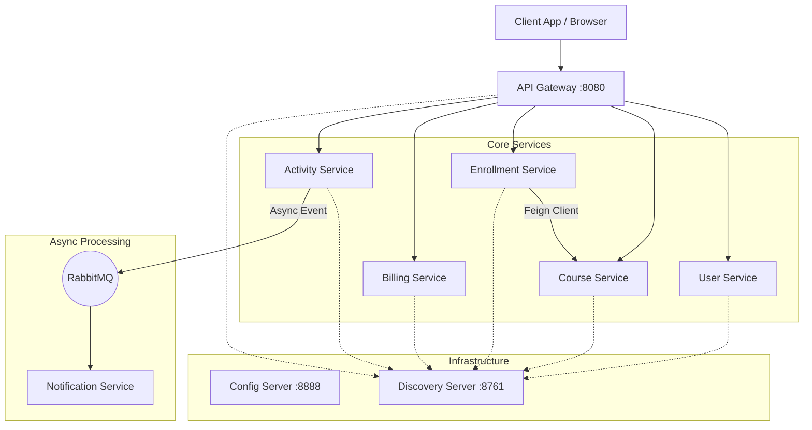

# Decentralized E-Learning Platform - Project Documentation

## 1. Project Summary
A robust, scalable **Microservices-based E-Learning Platform** built with **Spring Boot** and **Spring Cloud**. The system features a decentralized architecture where services like User Management, Course Catalog, Enrollment, and Billing operate independently but communicate seamlessly via **REST APIs (Feign Clients)** and **Asynchronous Messaging (RabbitMQ)**. Key engineering highlights include **Service Discovery (Eureka)**, **Centralized Configuration**, **API Gateway routing**, and **Fault Tolerance** using **Resilience4j Circuit Breakers** to ensure high availability even during partial system failures.

## 2. Key Features & Highlights
*   **Microservices Architecture**: Decoupled services for Users, Courses, Enrollments, Billing, and Notifications.
*   **Service Discovery**: Dynamic scaling and lookup using **Netflix Eureka Server**.
*   **API Gateway**: Centralized entry point with **Spring Cloud Gateway** for routing and load balancing.
*   **Inter-Service Communication**: Synchronous via **OpenFeign** and asynchronous via **RabbitMQ**.
*   **Fault Tolerance**: Implemented **Resilience4j Circuit Breaker** for graceful degradation during service outages.
*   **Centralized Configuration**: Managed external properties across environments using **Spring Cloud Config Server**.
*   **Event-Driven Notifications**: Asynchronous processing of user activities to trigger notifications.
*   **Database per Service**: Isolated data persistence using **H2/JPA** for domain boundaries.
*   **Distributed Tracing**: Architecture supports observability patterns for monitoring request flows.
*   **Scalable Design**: Stateless services designed for horizontal scaling in cloud environments.

## 3. Detailed Analysis & System Breakdown

### 3.1. System Architecture
The platform follows a classic microservices pattern. Requests enter through the API Gateway, which routes them to the appropriate service. Services register themselves with the Discovery Server.

### 3.2. Service Breakdown

| Service Name | Port | Description | Key Tech |
| :--- | :--- | :--- | :--- |
| **Config Server** | 8888 | Centralized configuration management for all microservices. | Spring Cloud Config |
| **Discovery Server** | 8761 | Service registry (Eureka) for dynamic service discovery. | Netflix Eureka |
| **API Gateway** | 8080 | Single entry point, routing, and load balancing. | Spring Cloud Gateway |
| **User Service** | Random | Manages user registration, authentication, and profiles. | Spring Data JPA, H2 |
| **Course Service** | Random | Manages course creation, details, and catalog. | Spring Web, Lombok |
| **Enrollment Service** | Random | Handles course enrollments with fault tolerance. | OpenFeign, Resilience4j |
| **Activity Service** | Random | Logs user actions and publishes events. | RabbitMQ Producer |
| **Notification Service** | Random | Consumes events to send emails/SMS. | RabbitMQ Consumer |

### 3.3. Key Workflows

#### A. Course Enrollment (Synchronous with Fallback)
This flow demonstrates the **Circuit Breaker** pattern. When a user attempts to enroll, the Enrollment Service must verify the course exists by calling the Course Service.
1.  **Request**: `POST /api/enrollments` hits API Gateway -> Enrollment Service.
2.  **Verification**: Enrollment Service uses `CourseClient` (Feign) to call Course Service.
3.  **Success Path**: Course exists -> Enrollment saved as `ACTIVE`.
4.  **Failure Path (Resilience)**: If Course Service is down, `Resilience4j` triggers the `enrollFallback` method. The enrollment is saved as `PENDING_VERIFICATION` instead of failing the request, ensuring a good user experience.

#### B. Activity Logging & Notification (Asynchronous / Event-Driven)
This flow demonstrates **Event-Driven Architecture** for decoupling high-throughput actions from side effects like notifications.
1.  **Action**: User completes a lesson. Client sends `POST /api/activities`.
2.  **Publish**: Activity Service saves the log and sends a message to the `activityQueue` in **RabbitMQ**.
3.  **Acknowledge**: Activity Service responds immediately to the user (low latency).
4.  **Process**: Notification Service (listening on `activityQueue`) picks up the message asynchronously.
5.  **Notify**: Notification Service triggers the email/SMS logic.

### 3.4. Technical Stack & Tools
*   **Language**: Java 17
*   **Framework**: Spring Boot 3.2.3
*   **Cloud Native**: Spring Cloud 2023.0.0 (Gateway, Config, Netflix Eureka, OpenFeign)
*   **Resilience**: Resilience4j (Circuit Breaker)
*   **Messaging**: RabbitMQ (AMQP)
*   **Database**: H2 (In-memory for dev/test), Spring Data JPA
*   **Build Tool**: Maven
